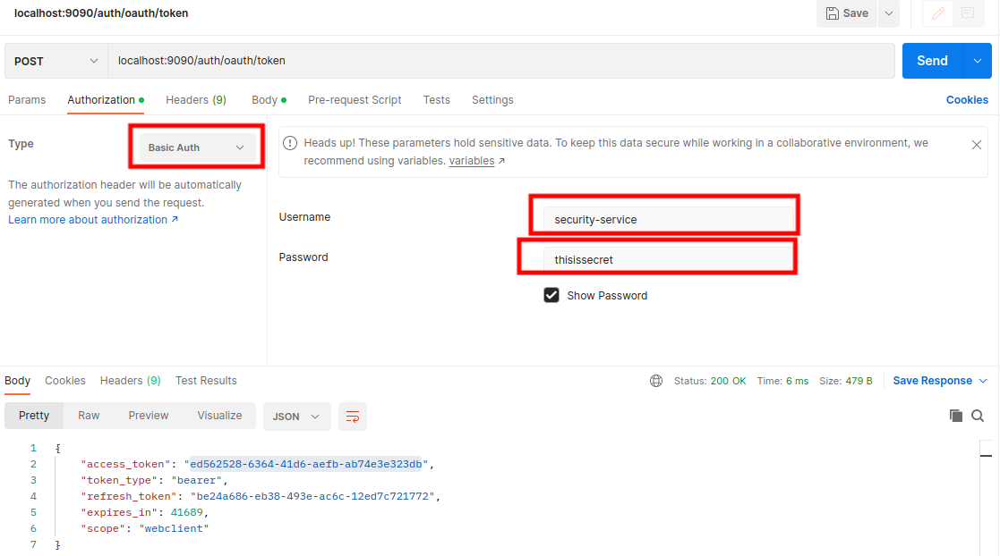
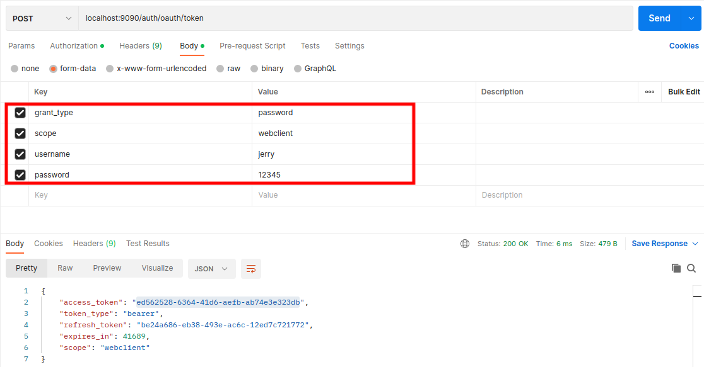

### OAuth2
#### 1、OAuth2是一个基于令牌的安全验证和授权框架，它将安全性分解为以下4个组成部分：
1、受保护的资源
2、资源所有者
3、应用程序
4、OAuth2验证服务器

这四个组成部分相互作用对用户进行验证，用户只需要提交他们的凭证。如果验证成功，则会出示一个令牌，该令牌可以在服务之间传递

#### 2、OAuth2规范具有4种类型授权：
1、密码
2、客户端凭证
3、授权码
4、隐式

#### 3、创建一个OAuth2验证服务
1、添加相关依赖
```xml
    <dependency>
        <groupId>org.springframework.cloud</groupId>
        <artifactId>spring-cloud-security</artifactId>
    </dependency>
    <dependency>
        <groupId>org.springframework.cloud</groupId>
        <artifactId>spring-cloud-starter-oauth2</artifactId>
    </dependency>
```
2、启动类添加相关注解
```java
@SpringBootApplication
@EnableAuthorizationServer
@EnableResourceServer
@RestController
@EnableEurekaClient
public class SecurityServiceApplication {

    public static void main(String[] args) {
        SpringApplication.run(SecurityServiceApplication.class, args);
    }
    
    /**
     * 该端点用于获取用户信息
     * @param authentication
     * @return
     */
    @GetMapping("/user")
    public Map<String,Object> user(OAuth2Authentication authentication){
        HashMap<String, Object> map = new HashMap<>();
        map.put("user",authentication.getUserAuthentication().getPrincipal());
        map.put("authorities",authentication.getUserAuthentication().getAuthorities());
        return map;
    }
}
```
3、添加配置类
```java
@Configuration
public class WebSecurityConfigurer extends WebSecurityConfigurerAdapter {

    @Override
    protected void configure(AuthenticationManagerBuilder auth) throws Exception {
        auth.inMemoryAuthentication()
                .withUser("tom")
                .password("12345")
                .roles("USER")
                .and()
                .withUser("jerry")
                .password("12345")
                .roles("ADMIN","USER");
    }

    @Bean
    @Override
    public AuthenticationManager authenticationManagerBean() throws Exception {
        return super.authenticationManagerBean();
    }
    @Bean
    @Override
    public UserDetailsService userDetailsServiceBean() throws Exception {
        return super.userDetailsServiceBean();
    }
}


@Configuration
public class OAuth2Config extends AuthorizationServerConfigurerAdapter {

    @Autowired
    private AuthenticationManager authenticationManager;

    @Autowired
    private UserDetailsService userDetailsService;

    @Override
    public void configure(ClientDetailsServiceConfigurer clients) throws Exception {
        
        /**
         * security-service 为当前服务名
         * thisissecret 为当前服务的秘钥
         * webclient、mobileclient 为授权的范围
         */
        clients
                .inMemory()
                .withClient("security-service")
                .secret("thisissecret")
                .authorizedGrantTypes("refresh_token","password","client_credentials")
                .scopes("webclient","mobileclient");
    }

    @Override
    public void configure(AuthorizationServerEndpointsConfigurer endpoints) throws Exception {
        endpoints.authenticationManager(authenticationManager).userDetailsService(userDetailsService);
    }
}
```
4、application.yml中添加配置(可选)
```yaml
server:
  contextPath: /auth
```
5、测试



#### 4、在其他服务被调用前需要验证当前用户
1、需要在被调用服务中添加相关依赖
```xml
    <dependency>
        <groupId>org.springframework.cloud</groupId>
        <artifactId>spring-cloud-security</artifactId>
    </dependency>
    <dependency>
        <groupId>org.springframework.cloud</groupId>
        <artifactId>spring-cloud-starter-oauth2</artifactId>
    </dependency>
```
2、启动类添加相关注解
```java
@SpringBootApplication
@EnableEurekaClient
@EnableCircuitBreaker
@EnableResourceServer
public class MyConsumerApplication {

    public static void main(String[] args) {
        SpringApplication.run(MyConsumerApplication.class, args);
    }
}
```
3、添加相关配置类
```java
@Configuration
public class ResourceServerConfiguration extends ResourceServerConfigurerAdapter {

    /**
     * 删除方法需要有管理员角色
     * @param http
     * @throws Exception
     */
    @Override
    public void configure(HttpSecurity http) throws Exception {
        http.authorizeRequests()
                .antMatchers(HttpMethod.DELETE,"/delete/**")
                .hasRole("ADMIN")
                .anyRequest().authenticated();
    }
}
```
4、在application.yml文件中添加如下配置(当调用服务需要验证用户会去下面配置的地址获取用户信息，
前提是需要将token通过请求头传到被调用的服务那里)
```yaml
security:
  oauth2:
    resource:
      user-info-uri: http://localhost:9090/auth/user
```

#### 5、传播OAuth2令牌
当一个服务调用下一个服务，而下一个服务也需要验证用户，可以通过将令牌传递到下游服务，实现步骤如下：
1、被调用者添加相关依赖
```xml
    <dependency>
        <groupId>org.springframework.cloud</groupId>
        <artifactId>spring-cloud-security</artifactId>
    </dependency>
    <dependency>
        <groupId>org.springframework.cloud</groupId>
        <artifactId>spring-cloud-starter-oauth2</artifactId>
    </dependency>
```
2、被调用者主启动类添加相关注解
```java
@SpringBootApplication
@EnableEurekaClient
@EnableCircuitBreaker
@EnableResourceServer
public class MyProductServiceApplication {

    public static void main(String[] args) {
        SpringApplication.run(MyProductServiceApplication.class, args);
    }

}
```
3、调用者添加新的配置
```java
@Configuration
public class ResourceSecurityConfig extends ResourceServerConfigurerAdapter {

    @Override
    public void configure(HttpSecurity http) throws Exception {
        http.authorizeRequests().anyRequest().authenticated();
    }
}
```
4、被调用者添加配置类,并修改调用方法（OAuth2RestTemplate是Spring OAuth2提供的一个支持OAuth2调用的REST模板类）
```java
@SpringBootApplication
@EnableEurekaClient
@EnableCircuitBreaker
@EnableResourceServer
public class MyConsumerApplication {

    public static void main(String[] args) {
        SpringApplication.run(MyConsumerApplication.class, args);
    }

    /**
     *  实例化一个OAuth2RestTemplate，
     *  通过依赖注入将注入OAuth2ProtectedResourceDetails，OAuth2ClientContext
     * @param protectedResourceDetails
     * @param auth2ClientContext
     * @return
     */
    @Bean
    public OAuth2RestTemplate oAuth2RestTemplate(OAuth2ProtectedResourceDetails protectedResourceDetails,OAuth2ClientContext auth2ClientContext){
        return new OAuth2RestTemplate(protectedResourceDetails,auth2ClientContext);
    }
}
```
```java
@Service
public class ConsumerServiceImpl implements ConsumerService {
    
    @Autowired
    private OAuth2RestTemplate restTemplate;

    @Override
    public HashMap<String,Object> getProductList() {
        HashMap forObject = restTemplate.getForObject("http://zuul-gateway/api/my-product-service/list", HashMap.class, (Object) null);
        return forObject;
    }
}
```
5、被调用者添加相关配置
```yaml
security:
    oauth2:
      resource:
        user-info-uri: http://localhost:9090/auth/user
```
6、网关服务添加相关配置（没有设置zuul.sensitive-headers属性，就意味着Zuul将自动阻止3个值：Cookie,Set-Cookie,Authorization,被传播）
```yaml
zuul:
  sensitive-headers: Cookie,Set-Cookie  # 这个是黑名单配置，表示这些东西不会传到下游服务
```
#### 6、微服务安全总结
1、对所有服务通信使用HTTPS/安全套接字层
2、所有服务调用都应通过API网关
3、将服务划分到公共API和私有API（公共API外部开放；私有API外部不开放，内部开放）
4、通过封锁不需要的网络端口来限制微服务的攻击面

客户端永远不应该直接访问运行服务的各个服务器，应该使用服务网关作为服务调用的入口点和守门人